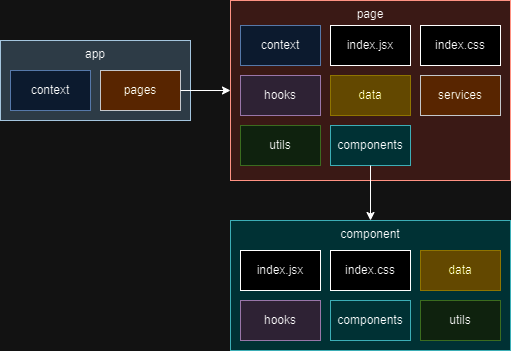

# App architecture and src directory structure

Since we´re using the React library to implement our application, a comoponent based approach should be used to structure our directories. So, first of all, our main folder has the following structure:

<figure><figcaption>
src folder structure
</figcaption></figure>

We will go deep further into every one of these elements in the next segment of the guide, but for now the application architecture is shown below:

<figure><figcaption>
App architecture
</figcaption></figure>

This is just a basic approach on how the application is structured where the app contains pages and and the pages contain components. If we want external services to wrap component clusters we can sorround them with contexts and control their status with hooks. The static data such as lists, constants or URL's will be stored into the data folder, and the auxiliar functionalities into the utils folder. To connect our frontend app with any API we will store the functions required into the services folder.


Extra directories such as mappings and validators are tools we will need to build our forms.

