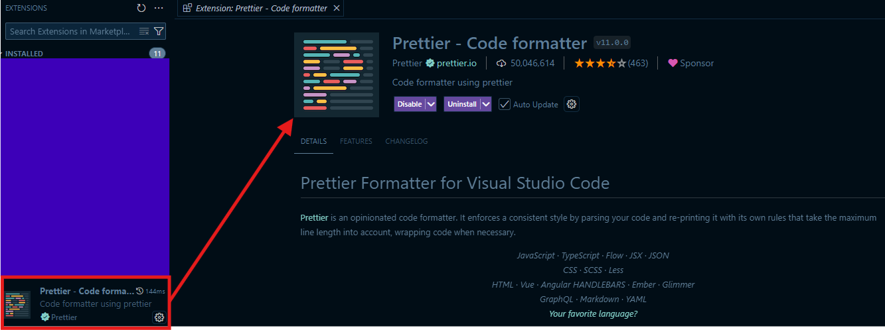

# Code

The main languages used for this project are <mark style="color:yellow;">JavaScript</mark>, <mark style="color:orange;">HTML5</mark> and <mark style="color:blue;">CSS3</mark>, which means some standards should be applied to make maintenance and future implementations more bearable.

To help developers format the code, the proper tool is Prettier which can be directly installed in the local machine or in the code editor we want to use. For more detailed info: [https://prettier.io/](https://prettier.io/).

As a first implementation of this project, the used editor is Visual Studio Code (Visit[https://code.visualstudio.com/](https://code.visualstudio.com/) to look for info and download) so Prettier can be downloaded as an extension.

<figure><figcaption><p>Installing Prettier from VS Extensions</p></figcaption></figure>

Then to set our editor to format code with Prettier we can simply right click into any of our editor tabs and select _"Format Document With..."_.

<figure><figcaption><p>Configuring formatter</p></figcaption></figure>

<figure><figcaption><p>Selecting Prettier as our default code formatter</p></figcaption></figure>

And then every time we want to format any of our code instances we simply repeat the same steps but clicking _"Format Document"_ instead.


<mark style="color:blue;">**Note**</mark><mark style="color:blue;">: Since VS Code does not provide a similar way to format every file inside a folder we can install Format Files from the extensions tab.</mark>&#x20;


<figure><figcaption><p>Format Files extension by jbockle</p></figcaption></figure>

***

So now we have a way to make our code look more elegant, but what about a code analizer to check some issues with our code. Since React lets developers control the app flow it's more prone to show some issues up, so as a tool to help us detect those issues while coding we'll be using ESLint (More info at [https://eslint.org/](https://eslint.org/)). The tool itself might be installed already if you've been following the documentation, since it's specified as a dependency in the <mark style="color:green;">packaje.json</mark> file, but if not just execute the following command:

```powershell
npm i
```

The file that configures ESLint behaviour within our dev enviroment is named <mark style="color:purple;">eslint.config.js</mark> and if we need to enable or disable some rules from the analizer we can modify it directly or install some plugins.

So, if we are coding and somehow made a mistake or flaw that will have a negative impact in the application when working, our editor (VS Code in this case) will warn us about these.

<figure><figcaption><p>Example of ESLint functionality</p></figcaption></figure>
